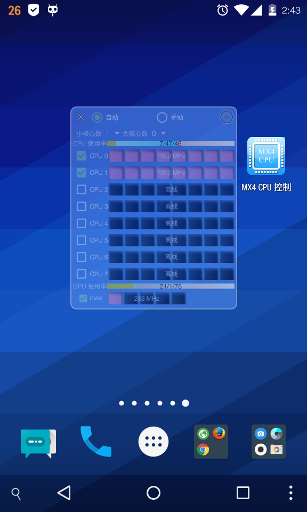
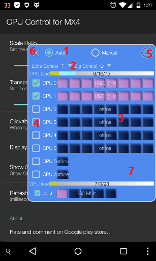
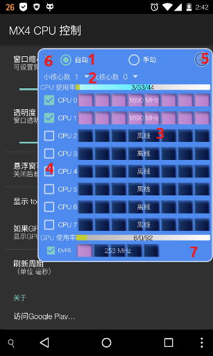

# Floating CPU Control 

Android app with floating window to control CPU.

[English](#English)

* [What settings can it change?](#settings)
* [How to use](#howtouse)
* [License](#license)s
* [Donation](#donation)

[中文](#Chinese)

* [App可设置的参数](#settings_cn)
* [如何使用](#howtouse_cn)
* [License](#license_cn)
* [捐赠](#donation_cn)

***
<a name="English"/>

This app requires ROOT permissions to change settings.
By now, this app is only tested using Meizu MX4. It MAY work in other devices.

## What settings can it change?
<a name="settings"/>

Active cores manually
> - /proc/hps/enabled   
> - /sys/devices/system/cpu/cpu*/online   

Minimum numbers of online big and little  cores 
> - /proc/hps/num_base_perf_serv 

Maximum scaling frequency 
> - /sys/devices/system/cpu/cpu*/cpufreq/scaling_max_freq

Disable GPU dvfs

>  - /sys/module/pvrsrvkm/parameters/gpu_dvfs_enable

**Refs:** 

 - [https://lists.launchpad.net/ubuntu-phone/msg14982.html](https://lists.launchpad.net/ubuntu-phone/msg14982.html)
 - [https://www.kernel.org/doc/Documentation/cpu-freq/pcc-cpufreq.txt](https://www.kernel.org/doc/Documentation/cpu-freq/pcc-cpufreq.txt)

## How to use
<a name="howtouse"/>

1. Use radio buttons to switch between *Auto* and  *Manual* modes.
2. Use spinners to set the minimum numbers of online big and little  cores.
3. Use square bars to limit the maximum scaling frequency. 
4. Use checkboxes to enable or disable cores. (in  *Manual* mode)
5. Click to close this app.
6. Click to minimize the floating window.
7. Touch and hold on the blank area to open/close the preference screen. Touch and drag to move the window.

> **CPU load bar:**    user / system(including IO) / idle

> **GPU load bar:**    loading / block / idle

## Reference projects:
1. [https://github.com/Trinea/android-common/blob/81cfc7ce0e93b2c4137fc8a37c836db6dccc6cea/src/cn/trinea/android/common/util/ShellUtils.java](https://github.com/Trinea/android-common/blob/81cfc7ce0e93b2c4137fc8a37c836db6dccc6cea/src/cn/trinea/android/common/util/ShellUtils.java)
2. [https://github.com/mikewang0326/FloatingViewDemo](https://github.com/mikewang0326/FloatingViewDemo)

## License
<a name="license"/>

The source code for this app is licensed under the MIT license, which you can find in the LICENSE file.

## Donation
<a name="donation"/>

If you find this app useful, you are welcome to donate any amount you wish :)

Paypal  | WeChat
------------- | -------------
 | 

***
<a name="Chinese"/>

# CPU控制悬浮窗 

修改设置时需要ROOT权限。目前仅在Meizu MX4中测试。

## App可设置的参数
<a name="settings_cn"/>

手动激活核心
> - /proc/hps/enabled   
> - /sys/devices/system/cpu/cpu*/online   

最少激活的大、小核心数
> - /proc/hps/num_base_perf_serv 

核心最高频率
> - /sys/devices/system/cpu/cpu*/cpufreq/scaling_max_freq

禁用GPU dvfs

>  - /sys/module/pvrsrvkm/parameters/gpu_dvfs_enable

**参见:** 

 - [https://lists.launchpad.net/ubuntu-phone/msg14982.html](https://lists.launchpad.net/ubuntu-phone/msg14982.html)
 - [https://www.kernel.org/doc/Documentation/cpu-freq/pcc-cpufreq.txt](https://www.kernel.org/doc/Documentation/cpu-freq/pcc-cpufreq.txt)

## 如何使用
<a name="howtouse_cn"/>

1. 点击单选按钮切换模式。
2. 选择大、小核心数。
3. 滑动或点击，限制最高频率。
4. 手动模式下激活、关闭核心。
5. 关闭App。
6. 最小化悬浮窗。
7. 空白处拖动改变位置。长按开关设置页面。

> **CPU 使用率指示:**    用户态 / 系统态 / 空闲

> **GPU 使用率指示:**    loading / block / idle

## 参考的项目:
1. [https://github.com/Trinea/android-common/blob/81cfc7ce0e93b2c4137fc8a37c836db6dccc6cea/src/cn/trinea/android/common/util/ShellUtils.java](https://github.com/Trinea/android-common/blob/81cfc7ce0e93b2c4137fc8a37c836db6dccc6cea/src/cn/trinea/android/common/util/ShellUtils.java)
2. [https://github.com/mikewang0326/FloatingViewDemo](https://github.com/mikewang0326/FloatingViewDemo)

## License
<a name="license_cn"/>

The source code for this app is licensed under the MIT license, which you can find in the LICENSE file.

## 捐赠
<a name="donation_cn"/>

欢迎捐赠,金额随意 :)

Paypal  | 微信
------------- | -------------
 | 