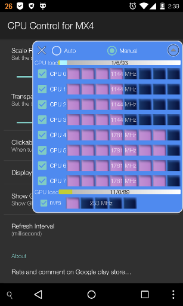
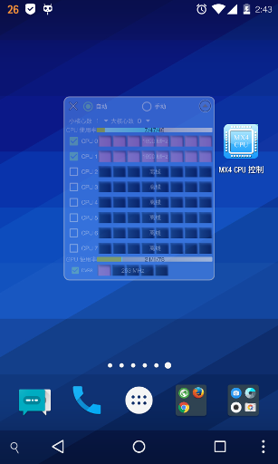

# Floating CPU Control 

[中文](#Chinese)

* [App可设置的参数](#settings_cn)
* [如何使用](#howtouse_cn)
* [License](#license_cn)
* [捐赠](#donation_cn)

***
<a name="Chinese"/>

# CPU控制悬浮窗 

修改设置时需要ROOT权限。目前仅在Meizu MX4中测试。

> 注意： <i> /proc/hps</i> 仅被MTK系的CPU支持。大小核心调节功能只在采用MTK CPU的型号（如MX4）中可见，采用其他CPU的型号（如MX4 PRO）中将被隐藏。

## App可设置的参数
<a name="settings_cn"/>

手动激活核心
> - /proc/hps/enabled   
> - /sys/devices/system/cpu/cpu*/online   

最少激活的大、小核心数
> - /proc/hps/num_base_perf_serv 

核心最高频率
> - /sys/devices/system/cpu/cpu*/cpufreq/scaling_max_freq

禁用GPU dvfs

>  - /sys/module/pvrsrvkm/parameters/gpu_dvfs_enable

**参见:** 

 - [https://lists.launchpad.net/ubuntu-phone/msg14982.html](https://lists.launchpad.net/ubuntu-phone/msg14982.html)
 - [https://www.kernel.org/doc/Documentation/cpu-freq/pcc-cpufreq.txt](https://www.kernel.org/doc/Documentation/cpu-freq/pcc-cpufreq.txt)

## 如何使用
<a name="howtouse_cn"/>

1. 点击单选按钮切换模式。
2. 选择大、小核心数。
3. 滑动或点击，限制最高频率。
4. 手动模式下激活、关闭核心。
5. 关闭App。
6. 最小化悬浮窗。
7. 空白处拖动改变位置。长按开关设置页面。

> **CPU 使用率指示:**    用户态 / 系统态 / 空闲

> **GPU 使用率指示:**    loading / block / idle

## 参考的项目:
1. [https://github.com/Trinea/android-common/blob/81cfc7ce0e93b2c4137fc8a37c836db6dccc6cea/src/cn/trinea/android/common/util/ShellUtils.java](https://github.com/Trinea/android-common/blob/81cfc7ce0e93b2c4137fc8a37c836db6dccc6cea/src/cn/trinea/android/common/util/ShellUtils.java)
2. [https://github.com/mikewang0326/FloatingViewDemo](https://github.com/mikewang0326/FloatingViewDemo)

## License
<a name="license_cn"/>

The source code for this app is licensed under the MIT license, which you can find in the LICENSE file.

## 捐赠
<a name="donation_cn"/>

欢迎捐赠,金额随意 :)

Paypal  

